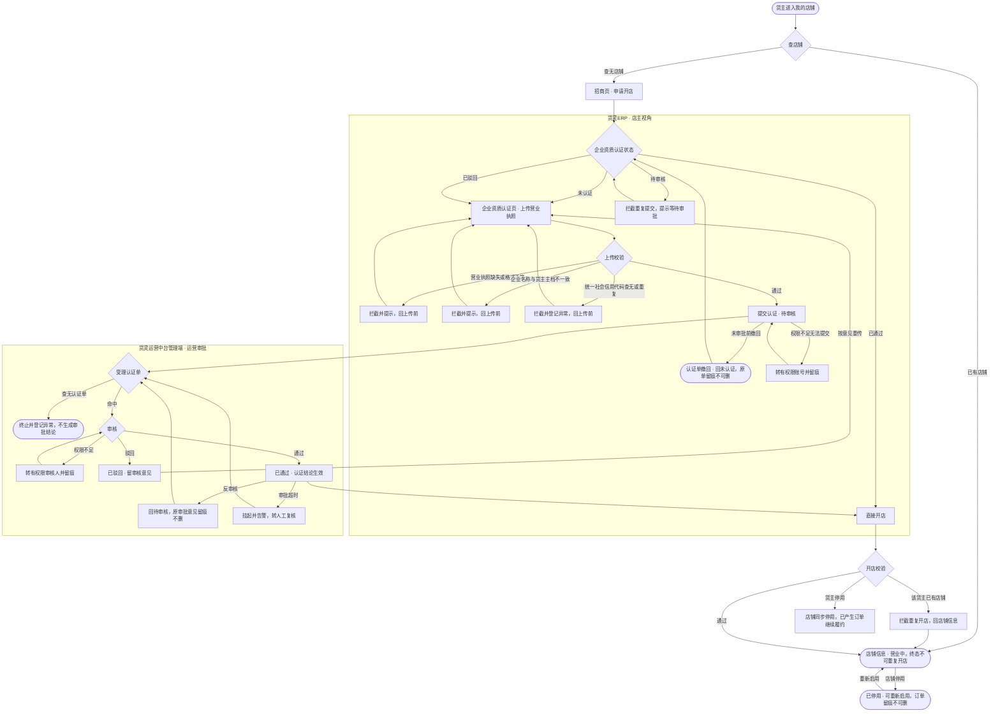

```mermaid
flowchart TD
  S(["货主进入我的店铺"]) --> Q{"查店铺"}
  Q -->|已有店铺| S1(["店铺信息 · 营业中，终态不可重复开店"])
  Q -->|查无店铺| I["招商页 · 申请开店"]
  I --> C{"企业资质认证状态"}

  subgraph OWN["货灵ERP · 店主视角"]
    C -->|已通过| O1["直接开店"]
    C -->|未认证| U1["企业资质认证页 · 上传营业执照"]
    C -->|已驳回| U1
    C -->|待审核| W1["拦截重复提交，提示等待审批"]
    W1 --> C
    U1 --> U2{"上传校验"}
    U2 -->|营业执照缺失或格式不符| X1["拦截并提示，回上传前"]
    X1 --> U1
    U2 -->|企业名称与货主主档不一致| X2["拦截并提示，回上传前"]
    X2 --> U1
    U2 -->|统一社会信用代码查无或重复| X3["拦截并登记异常，回上传前"]
    X3 --> U1
    U2 -->|通过| U3["提交认证 · 待审核"]
    U3 -->|未审批前撤回| R1(["认证单撤回 · 回未认证，原单留痕不可删"])
    R1 --> C
    U3 -->|权限不足无法提交| X4["转有权限账号并留痕"]
    X4 --> U3
  end

  subgraph NET["货灵运营中台管理端 · 运营审批"]
    U3 --> P1{"受理认证单"}
    P1 -->|查无认证单| X5(["终止并登记异常，不生成审批结论"])
    P1 -->|命中| P2{"审核"}
    P2 -->|权限不足| X6["转有权限审核人并留痕"]
    X6 --> P2
    P2 -->|驳回| R2["已驳回 · 留审核意见"]
    R2 -->|按意见重传| U1
    P2 -->|通过| P3["已通过 · 认证结论生效"]
    P3 -->|反审核| R3["回待审核，原审批意见留痕不删"]
    R3 --> P1
    P3 -->|审批超时| X7["挂起并告警，转人工复核"]
    X7 --> P1
  end

  P3 --> O1
  O1 --> Q2{"开店校验"}
  Q2 -->|该货主已有店铺| X8["拦截重复开店，回店铺信息"]
  X8 --> S1
  Q2 -->|货主停用| X9["店铺同步停用，已产生订单继续履约"]
  Q2 -->|通过| S1
  S1 -->|店铺停用| R4(["已停用 · 可重新启用，订单留痕不可删"])
  R4 -->|重新启用| S1
```
