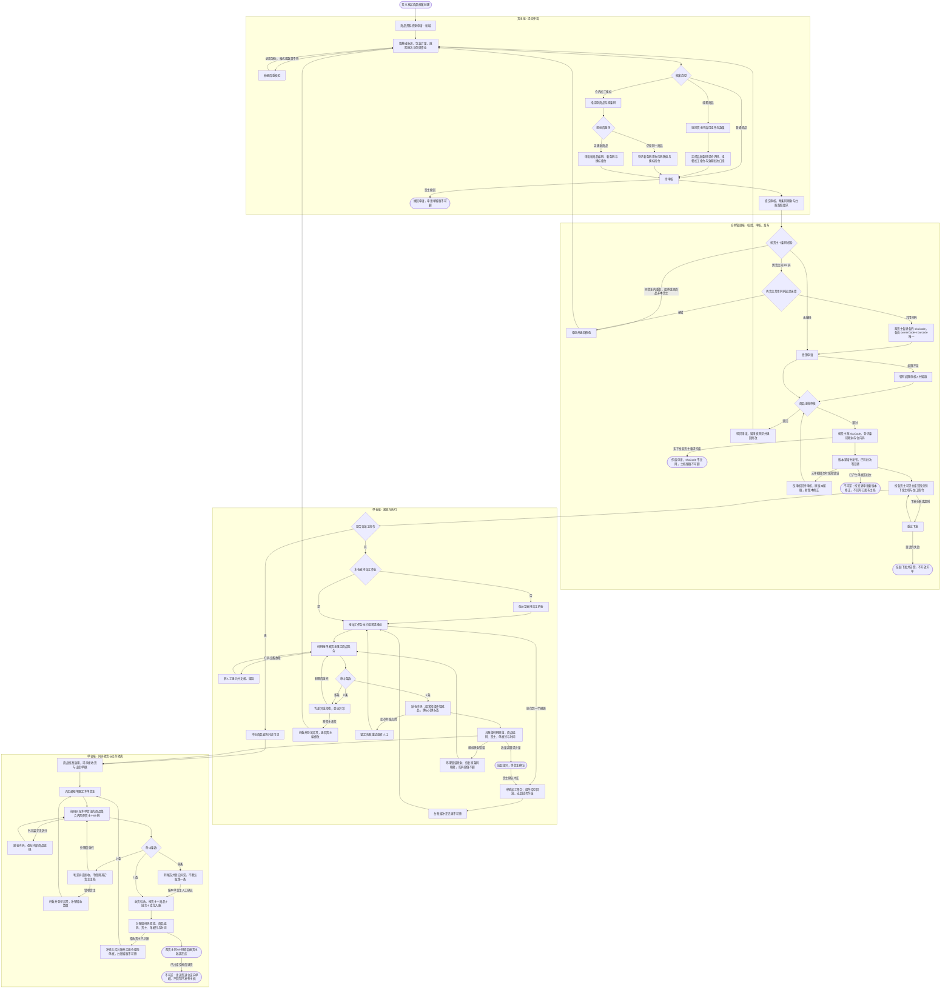

```mermaid
flowchart TD
  S(["货主发起商品档案创建"]) --> A1

  subgraph OWN["货主端 · 提交申请"]
    A1["商品资料变更申请 · 新增"] --> A2["填基础标识、包装计量、效期批次与存储作业"]
    A2 -->|必填缺失、格式或数量不符| X1["补录后重校验"]
    X1 --> A2
    A2 --> C1{"档案类型"}
    C1 -->|普通商品| A6["待审核"]
    C1 -->|组套商品| K1["选同货主已启用组件与数量"]
    K1 --> K2["定成品新条码或仓内码、组套加工指令与效期批次口径"]
    K2 --> A6
    C1 -->|仓内加工换标| L1["指定原商品与原条码"]
    L1 --> L2{"换标后身份"}
    L2 -->|仍是同一商品| L3["登记新条码或仓内码映射与换标指令"]
    L2 -->|另建新商品| L4["申请新商品编码、新条码与换标指令"]
    L3 --> A6
    L4 --> A6
    A6 --> A7["提交审核，附条码映射与台账留痕要求"]
    A6 -->|货主撤回| R1(["撤回申请，申请单留痕不可删"])
  end

  subgraph NET["仓网管理端 · 校验、审核、发布"]
    A7 --> B1{"按货主＋条码校验"}
    B1 -->|同货主内重复、组件或原商品非本货主| X2["拒绝并退回修改"]
    X2 --> A2
    B1 -->|跨货主同 69 码| B2{"两货主共用同码还是录错"}
    B2 -->|录错| X2
    B2 -->|共用同码| B8["两货主各建各的 skuCode，各自 ownerCode＋barcode 唯一"]
    B8 --> B3["受理申请"]
    B1 -->|无撞码| B3
    B3 -->|权限不足| X11["转有权限审核人并留痕"]
    X11 --> B4{"商品主档审核"}
    B3 --> B4
    B4 -->|驳回| X3["驳回申请，留审核意见并退回修改"]
    X3 --> A2
    B4 -->|通过| B5["按货主赋 skuCode，登记条码映射与仓内码"]
    B5 -->|未下发且货主要求作废| R4(["作废申请，skuCode 不复用，主档留痕不可删"])
    B5 --> B6["版本递增并发布，已有批次不回溯"]
    B6 -->|无单据批次时发现错误| R2["反审核回待审核，原版本留痕，新版本修正"]
    R2 --> B4
    B6 -->|已产生单据或批次| R3(["不可逆：按变更申请新版本修正，不回写已发布主档"])
    B6 --> B7["按各货主可见仓库范围分别下发主档与加工指令"]
    B7 -->|下发失败或超时| X4["重试下发"]
    X4 --> B7
    X4 -->|重试仍失败| X5(["挂起下发并告警，不开放开单"])
  end

  subgraph WH["单仓端 · 接收与执行"]
    B7 --> D1{"是否含加工指令"}
    D1 -->|无| D2["本仓商品查询只读可见"]
    D1 -->|有| D3{"本仓支持加工作业"}
    D3 -->|否| X6["改派至支持加工的仓"]
    X6 --> D4["按加工任务执行组套或换标"]
    D3 -->|是| D4
    D4 -->|执行到一半撤销| R5["冲销加工任务：组件库存回滚、成品批次作废"]
    R5 --> R6["台账留冲正记录不可删"]
    R6 --> D4
    D4 --> D5["扫码按单据货主限定商品集合"]
    D5 -->|扫码设备故障| X7["转人工录入并复核，留痕"]
    X7 --> D5
    D5 --> D6{"命中条数"}
    D6 -->|0 条| X8["判差异或拒收，登记异常"]
    D6 -->|多条| X8
    X8 -->|处理后重扫| D5
    X8 -->|跨货主串货| X10["拦截并登记异常，退回货主端修改"]
    X10 --> A2
    D6 -->|1 条| D8["贴仓内码；组套扣组件增成品，换标只换标签"]
    D8 -->|库存并发占用| X12["锁定失败重试或转人工"]
    X12 --> D4
    D8 --> D10["台账留扫码原值、商品编码、货主、单据行与时间"]
    D10 -->|数量超量或少量| X9(["挂起差异，等货主确认"])
    X9 -->|货主确认冲正| R5
    D10 -->|换标映射错误| R7["停用错误映射、恢复原条码映射，扫码原值不删"]
    R7 --> D5
  end

  subgraph INB["单仓端 · 同码收货与库存隔离"]
    E["商品档案启用，可承接收货与出库单据"] --> H1["入库通知单限定本单货主"]
    H1 --> H2["扫码只在本单货主的商品集合内匹配货主＋69 码"]
    H2 -->|外包装无法区分| H7["贴仓内码，改扫内部商品编码"]
    H7 --> H2
    H2 --> H3{"命中条数"}
    H3 -->|0 条| H4["判差异或拒收，不借用其它货主主档"]
    H4 -->|处理后重扫| H2
    H4 -->|错收货主| H9["拦截并登记异常，冲销错收数量"]
    H9 --> H1
    H3 -->|多条| H5["列候选并登记异常，不默认取第一条"]
    H5 -->|按本单货主人工确认| H6
    H3 -->|1 条| H6["收货验收，按货主＋商品＋批次＋库位入账"]
    H6 --> H8["台账留扫码原值、商品编码、货主、单据行与时间"]
    H8 -->|错收货主已入账| H10["冲销入库台账并走退仓逆向单据，台账留痕不可删"]
    H10 --> H1
    H8 --> Z(["两货主同 69 码商品按货主隔离在库"])
    Z -->|已出库交接后退货| R8(["不可逆：走退货退仓逆向单据，不回写已发布主档"])
  end

  D2 --> E
  D10 --> E
```
