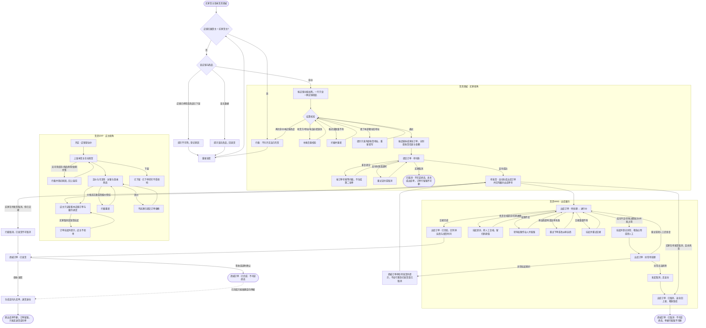
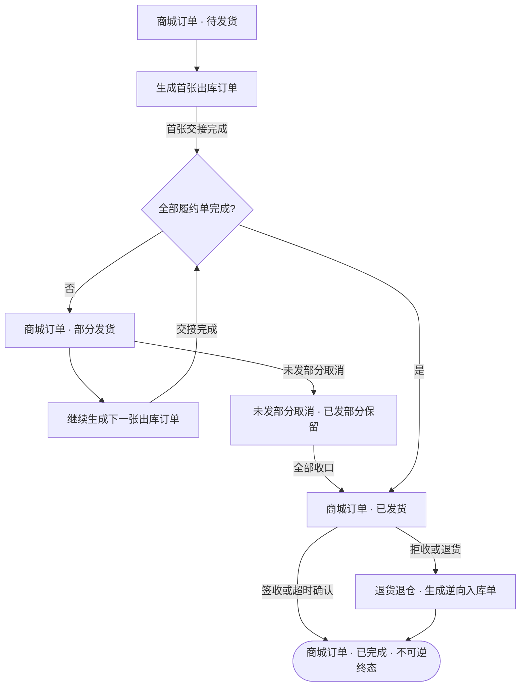

```mermaid
flowchart TD
  S(["买家货主登录货灵商城"]) --> C0{"店铺归属货主 = 买家货主?"}
  C0 -->|是| X0["拦截：不允许买自己的货"]
  X0 --> S0["重新选货"]
  S0 --> C0
  C0 -->|否| A0{"查店铺与商品"}
  A0 -->|店铺已停用或商品已下架| X13["提示不可购，登记原因"]
  X13 --> S0
  A0 -->|查无数据| X14["提示查无商品，回选货"]
  X14 --> S0
  A0 -->|命中| A1["按店铺分组加购，一行只含一家店铺商品"]

  subgraph BUY["货灵商城 · 买家视角"]
    A1 --> A2{"结算校验"}
    A2 -->|收货方/地址/电话必填缺失| X1["补录后重校验"]
    X1 --> A2
    A2 -->|格式或数量不符| X15["拦截并重填"]
    X15 --> A2
    A2 -->|填了本部署仓库地址| X2["提示只发外部收货地址，重新填写"]
    X2 --> A2
    A2 -->|再次命中本店铺商品| X0
    A2 -->|通过| A3["按店铺拆成多张订单，分别填收货信息与金额"]
    A3 --> A4["提交订单 · 待付款"]
    A4 -->|重复提交| X3["按订单号幂等拦截，不生成第二张单"]
    X3 --> A4
    A4 -->|支付失败或超时| X4["重试支付或取消"]
    X4 --> A4
    A4 -->|买家取消| R1(["已取消 · 不可逆终态，未生成出库单，订单行留痕不可删"])
    A4 -->|支付成功| A5["待发货 · 自动生成出库订单并回写履约出库单号"]
  end

  subgraph OWN["货灵ERP · 店主视角"]
    A5 --> B1["店主只读查看本店铺订单与履约进度"]
    B1 -->|买家取消或缺货挂起| B2["订单挂起并提示，店主不拒单"]
    B2 --> B1
    B3["开店 · 店铺营业中"] --> B4["上架本货主在仓现货"]
    B4 -->|无可用库存/商品停用/效期禁售| X5["拦截并登记原因，回上架前"]
    X5 --> B4
    B4 --> B5["定价与可见性 · 访客与登录两态"]
    B5 -->|价格非正数或阶梯价倒挂| X6["拦截重填"]
    X6 --> B5
    B5 --> B1
    B4 -->|下架| B6["已下架 · 已下单的行不受影响"]
    B5 -->|改价| B7["不追溯已提交订单金额"]
    B7 --> B5
  end

  subgraph WMS["货灵WMS · 出库履约"]
    A5 --> D1["出库订单 · 待处理 → 进行中"]
    D1 -->|库存不足/禁售过期批次/并发占用| X7["挂起并登记异常，释放占用或转人工"]
    X7 --> D2["出库订单 · 异常待处理"]
    D2 -->|重试或转人工后恢复| D1
    D2 -->|异常无法排除| R2["发起取消，走返仓"]
    R2 --> R3["出库订单 · 已取消，返仓回上架、释放锁库"]
    D1 -->|拣货复核差异/扫码故障| X8["挂起差异、转人工复核，留扫码原值"]
    X8 --> D1
    D1 -->|权限不足| X12["转有权限作业人并留痕"]
    X12 --> D1
    D1 -->|承运商超时或运单失败| X16["重试下单或改派承运商"]
    X16 --> D1
    D1 -->|交接数量不符| X9["挂起并重试交接"]
    X9 --> D1
    D1 -->|交接完成| D3["出库订单 · 已完成，回写承运商与发货时间"]
  end

  D3 --> A6["商城订单 · 已发货"]
  A6 -->|签收或超时确认| A7(["商城订单 · 已完成 · 不可逆终态"])
  A6 -->|拒收/退货| R4["生成逆向入库单，退货退仓"]
  R4 --> R5(["原出库单不删，订单留痕，只能走退货逆向单"])
  A7 -.->|已完成只能新建逆向单据| R4

  A5 -->|买家在待发货取消，且未拣货| R3
  R3 --> R6(["商城订单 · 已取消 · 不可逆终态，单据行留痕不可删"])
  A5 -->|买家在待发货取消，但已交接| X10["拦截取消，已发货不可取消"]
  X10 --> A6
  D2 -->|异常挂起期间| X11["商城订单停在待发货并提示，不自行跳到已发货或已取消"]
  X11 --> A5
```

## 一单多履约与部分发货

商城订单仍只走仓发货，但一个订单可以拆多张出库单。首张出库单交接后，商城订单转「部分发货」；全部履约单交接完成才转「已发货」。`obNo` 只存首张主履约单号，全部履约单见履约单视图。

```mermaid
flowchart TD
  A["商城订单 · 待发货"] --> B["生成首张出库订单"]
  B -->|首张交接完成| C{"全部履约单完成?"}
  C -->|否| D["商城订单 · 部分发货"]
  D --> E["继续生成下一张出库订单"]
  E -->|交接完成| C
  D -->|未发部分取消| F["未发部分取消 · 已发部分保留"]
  F -->|全部收口| G["商城订单 · 已发货"]
  C -->|是| G
  G -->|签收或超时确认| H(["商城订单 · 已完成 · 不可逆终态"])
  G -->|拒收或退货| I["退货退仓 · 生成逆向入库单"]
  I --> H
```
