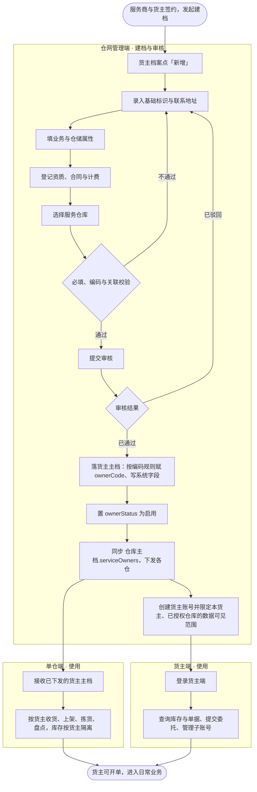

```mermaid
flowchart TD
  S(["服务商与货主签约，发起建档"]) --> A1

  subgraph NET["仓网管理端 · 建档与审核"]
    A1["货主档案点「新增」"] --> A2["录入基础标识与联系地址"]
    A2 --> A3["填业务与仓储属性"]
    A3 --> A4["登记资质、合同与计费"]
    A4 --> A5["选择服务仓库"]
    A5 --> C1{"必填、编码与关联校验"}
    C1 -->|不通过| A2
    C1 -->|通过| A6["提交审核"]
    A6 --> C2{"审核结果"}
    C2 -->|已驳回| A2
    C2 -->|已通过| A7["落货主主档：按编码规则赋 ownerCode、写系统字段"]
    A7 --> A8["置 ownerStatus 为启用"]
    A8 --> A9["同步 仓库主档.serviceOwners，下发各仓"]
    A9 --> A10["创建货主账号并限定本货主、已授权仓库的数据可见范围"]
  end

  subgraph WH["单仓端 · 使用"]
    B1["接收已下发的货主主档"] --> B2["按货主收货、上架、拣货、盘点，库存按货主隔离"]
  end

  subgraph OWN["货主端 · 使用"]
    D1["登录货主端"] --> D2["查询库存与单据、提交委托、管理子账号"]
  end

  A9 --> B1
  A10 --> D1
  B2 --> E(["货主可开单，进入日常业务"])
  D2 --> E
```
